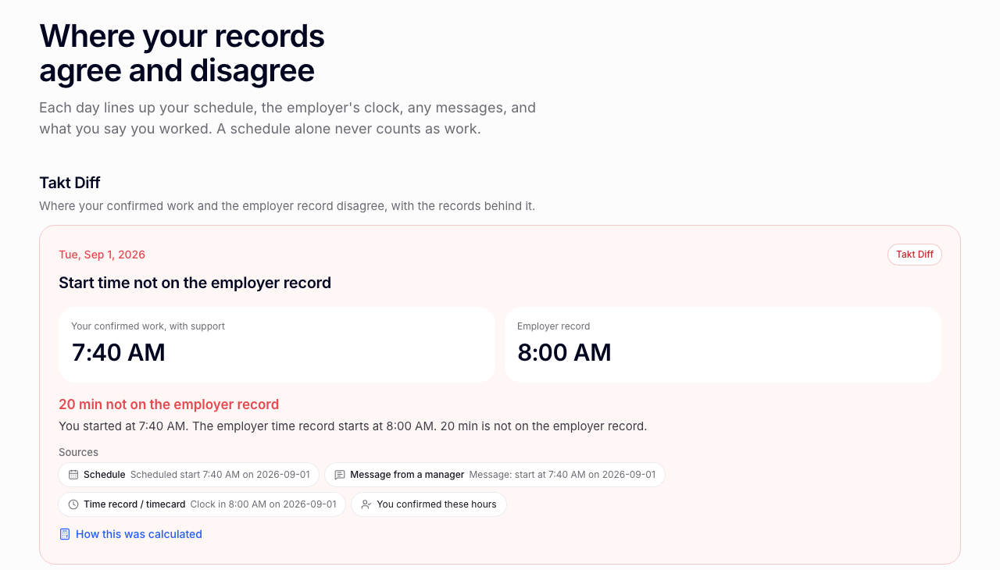

# Takt

Takt lines up a worker's schedule, the employer's time record, pay stubs, and
manager messages day by day, shows exactly where they disagree, and exports a
California wage-claim packet anyone can re-verify.

**Live:** https://takt-beige.vercel.app · **Proof:** https://takt-beige.vercel.app/proof



## How it works

1. **Intake.** Add PDFs, photos, or screenshots. Each original is SHA-256
   fingerprinted before anything reads it and stays in the browser (IndexedDB).
2. **Review.** Digital PDFs are read on-device from their own text layer with
   pdf.js. Photos and scans are read by Gemini, which must return a box and the
   exact quoted text for every value. Every value is outlined in the original,
   and nothing counts until the worker confirms, fixes, or rejects it.
3. **Line and Diff.** Each day aligns the schedule, the employer clock,
   messages, and the worker's own account (see [evidence policy](#evidence-policy)).
4. **Calc.** California regular, daily overtime (over 8 h), double time
   (over 12 h), weekly overtime (over 40 h), and seventh-day rules in plain
   TypeScript, with integer minutes and exact bigint fractions. No model does
   arithmetic.
5. **Packet.** Fills the official DLSE Form 1 (REV. 07/2025) and, for
   irregular schedules, the official DLSE Form 55 workbook. It also writes
   `evidence-index.pdf`, `calculation.csv`, and a canonical `manifest.json`.
6. **Verify.** Re-hashes every file, replays reconciliation and calculation
   from the manifest, re-does the money with a separate fraction
   implementation, and reads both forms back. It runs in the browser
   (`/verify`) or from the CLI.

When records conflict, evidence is missing, or the job falls outside the
supported rules, Takt says so and gives no amount.

## Try it

In the live app, open **My cases → Sample cases**. The samples are synthetic
(invented people and records) and run through the same code as real uploads.

| Case | Scenario | Result |
|---|---|---|
| TAKT-DEMO-001 | Schedule and manager text say 7:40, the clock says 8:00 | 20 min, $9.25, packet verified |
| TAKT-CONTROL-001 | All records agree | no discrepancy, no claim |
| TAKT-AMBIG-001 | Two timecard exports disagree, one early start is unsupported | calculation refused |
| TAKT-UNSUPPORTED-001 | Piece-rate pay | amount refused, with reasons |

`/proof` links a canonical packet and a tampered copy to try on `/verify`.

## Run locally

Requires Node 24.

```bash
npm ci
npm run dev                      # http://localhost:3000
npm run lint && npm run typecheck
npm test                         # unit, property, packet, tamper, privacy
npm run build && npm run test:e2e   # Playwright, mobile + desktop
npx tsx scripts/canonical-run.ts                          # rebuilds evidence/canonical
npm run verify:packet -- evidence/canonical/takt-demo.zip # exits 0 only if verified
npx tsx scripts/proof-campaign.ts                         # fixtures + tamper cohort
npm run pin:legal:check          # compares pinned forms with dir.ca.gov
```

Image reading needs `GEMINI_API_KEY` in `.env.local` (see `.env.example`).
Without it, images can be entered by hand and everything else works.
`npm run benchmark` compares Takt with a generic model on the same files and
needs the key.

## Evidence policy

Legal rules (`CA-*`) come from the Labor Commissioner's published guidance,
pinned in `legal/ca-dlse/rules/`. The `TAKT-*` rules are Takt's own policy about
what it is willing to count. They are not law.

| Rule | Policy |
|---|---|
| `TAKT-DIFF-START` | An earlier start than the employer record counts only if the worker confirms it **and** a schedule or message supports it. Counted from the later of the two. |
| `TAKT-DIFF-END` | Same for a later end. Counted until the earlier of the two. |
| `TAKT-DIFF-MISSING` | A worked day missing from the employer record counts only if independent records support both its start and end. |
| `TAKT-DIFF-PAID-HOURS` | Hours on the employer's own time record are compared with hours paid on the wage statement. |
| `TAKT-DIFF-PAYSTUB-MATH` | Each wage-statement line is checked as hours × rate. |
| `TAKT-ROUND-CENTS` | Exact amounts are rounded half away from zero once per pay period and pay type. |

A schedule alone never counts as work. Unreviewed facts, facts from duplicate
files, and days where two employer records disagree never feed a calculation.

## Official forms

- **Form 1** (`legal/ca-dlse/form-1`) is a real AcroForm with 250 fields. Fields
  are mapped by position and printed question, because several internal names
  are stale (the independent-contractor question's field is named
  `IS THIS CLAIM RELATED TO COVID-19?`). Takt never fills the signature or date.
  Output is read back with pdf.js, a different library from the writer.
- **Form 55** (`legal/ca-dlse/form-55`) is a legacy `.xls` with one row per pay
  period and no daily time cells, one sheet per pay rate. Takt patches the
  original BIFF8 stream record by record so the official formatting survives,
  and tests diff every non-cell record against the pinned file.

Both templates are hash-checked before every fill.

## Architecture and security

- One Zod contract (`src/lib/domain/contracts.ts`) for every value that can
  reach a calculation. Model output is parsed into it or dropped.
- Dates and times are strings. No timezone parsing. Daylight saving is applied
  explicitly, and readings inside a skipped or repeated hour are refused.
- No database. The only server route, `/api/extract`, forwards one image to
  Gemini and returns candidate facts. It writes nothing and logs no content.
- No analytics or session replay. The API key is server-only.
- Packets are byte-for-byte reproducible from the same inputs.

| Path | Contents |
|---|---|
| `src/lib/domain`, `src/lib/calc` | contract, reconciliation, overtime calculation |
| `src/lib/forms` | Form 1 and Form 55 writers and readers |
| `src/lib/extraction`, `src/lib/ai` | native PDF extraction, vision schema and validation |
| `src/lib/packet` | packet builder, evidence index, verifier |
| `legal/ca-dlse` | pinned official forms and guidance with hashes |
| `fixtures` | synthetic evidence and hand-labeled ground truth |
| `evidence` | canonical run, campaign results, tamper sample |

## Limits

California hourly, non-exempt work under standard overtime rules. It does not
cover meal or rest premiums, penalties, piece rate or commission, union
contracts, alternative workweeks, or special industries. Verification proves a
packet is internally consistent, not that its facts are true. Takt is not legal
advice and files nothing. Full list: https://takt-beige.vercel.app/limitations

## Credits

Next.js, React, Tailwind CSS, shadcn/ui, Zod, Dexie, pdf.js, pdf-lib, SheetJS,
cfb, fflate, `@google/genai`, Vitest, fast-check, Playwright. Noto Sans (SIL
OFL 1.1, `assets/fonts/OFL.txt`). Official forms and guidance from the
California Department of Industrial Relations. The code was written with AI
coding assistance.

## License

[MIT](LICENSE)
