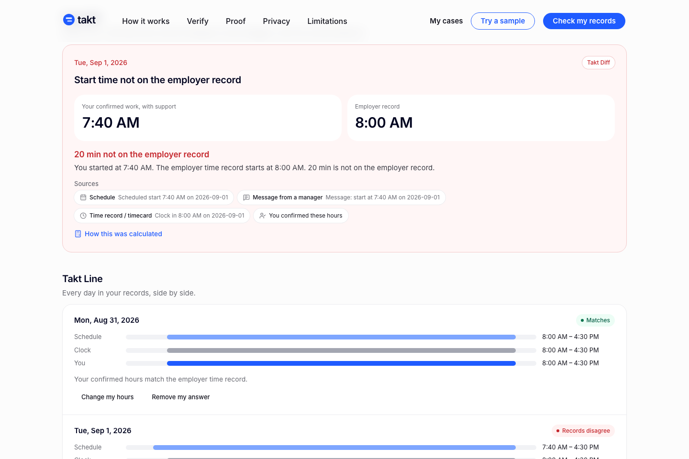

# Takt

Takt reconstructs worked time from independent employment records and shows
where they disagree. A worker adds the schedule, the employer's time record,
pay stubs, and manager messages they already have. Takt lines them up day by
day, finds the differences each record supports, computes the supported pay
difference in plain code, and exports a California wage-claim packet that
anyone can re-verify.

- **Live:** https://takt-beige.vercel.app
- **Proof:** https://takt-beige.vercel.app/proof
- **Repository:** https://github.com/winsznx/takt
- **Demo video:** https://youtu.be/wSUVPrnWkmw



## Why

California's Labor Commissioner asks wage claimants to track their start and
end times and bring pay stubs, and asks workers with irregular hours to add up
hours and pay per pay period on Form 55. The evidence is often split across
records that each tell part of the story. Takt turns them into one checkable
account. Sources and their limits: [docs/IMPACT_EVIDENCE.md](docs/IMPACT_EVIDENCE.md).

## How it works

1. **Intake.** PDFs, photos, and screenshots are fingerprinted (SHA-256)
   before anything reads them and stay in the browser (IndexedDB).
2. **Review.** Digital PDFs are read on the device from their own text layer.
   Every extracted value is outlined where it appears in the original. Nothing
   counts until the worker confirms, fixes, or rejects it.
3. **Line and Diff.** Each day aligns the schedule, the employer's clock,
   messages, and the worker's own account. Extra time counts only when the
   worker confirms it **and** an independent record supports it. A schedule
   alone never counts as work.
4. **Calc.** California regular pay, daily overtime (over 8 h), double time
   (over 12 h), weekly overtime (over 40 h), and seventh-day rules, in
   TypeScript with integer minutes and exact fractions.
5. **Packet.** The official DLSE Form 1 (REV. 07/2025) and, for irregular
   schedules, the official Form 55 workbook, plus an evidence index,
   `calculation.csv`, and a canonical `manifest.json`.
6. **Verify.** Re-hashes every file, replays the comparison and calculation
   from the manifest, re-does the money with a separate fraction
   implementation, and reads both forms back. In the browser (`/verify`) or
   `npm run verify:packet`.

When records conflict, evidence is missing, or the job has special rules,
Takt stops and says why instead of producing an amount.

## What AI does and what code does

| AI (Gemini `gemini-3.8-flash`) | Deterministic code |
|---|---|
| Reads images: proposes candidate facts, each with a box and the exact quoted text | Reads digital PDFs on-device with pdf.js |
| Classifies a document | Validates every candidate against a Zod contract and drops the rest |
| | Flags values the quote doesn't contain or dates far from the case |
| | Decides discrepancies, applies rules, computes money, fills forms, verifies packets |

The worker confirms every consequential fact. No model decides a discrepancy,
does arithmetic, or marks a packet verified.

## Privacy on this deployment

- Cases and original files stay in the browser. Takt has no database or file
  storage. There are no accounts or analytics.
- This deployment uses Google's **unpaid** Gemini API. Google's terms for unpaid
  use allow Google to use submitted content to improve its products and say
  not to submit personal information. So the server runs in `synthetic-only`
  mode: it forwards an image to the model **only** if its SHA-256 matches one
  of Takt's committed synthetic sample images (`src/lib/ai/synthetic-allowlist.json`).
  A worker's real photos and scans are refused before any model call. They
  type in what those images show.
- `TAKT_AI_MODE=full` turns image reading on for real uploads. Use it only
  with a provider tier whose terms fit personal employment records.

## Try it

**My cases → Sample cases** runs synthetic cases through the same code as real
uploads:

| Case | Scenario | Result |
|---|---|---|
| TAKT-DEMO-001 | Schedule and manager text say 7:40, the clock says 8:00 | 20-minute discrepancy, supported amount, packet verified |
| TAKT-CONTROL-001 | All records agree | no discrepancy, no claim |
| TAKT-AMBIG-001 | Two timecard exports disagree, one early start is unsupported | calculation refused |
| TAKT-UNSUPPORTED-001 | Piece-rate pay | amount refused, with reasons |

`/proof` links a canonical packet and a tampered copy to try on `/verify`.

## Evidence

- `evidence/canonical/run.json`: the canonical TAKT-DEMO-001 run, packet hash,
  and every verifier check.
- `evidence/campaign/results.json`: all four synthetic cases and ten tamper
  mutations, expected vs. observed.
- `evidence/benchmark/summary.json`: the comparison with a general-purpose model
  on the same files. It has not completed (the provider returned "high demand"
  errors), so no comparison is claimed.

These are synthetic cases written alongside Takt. They show designed behaviour,
not real-world accuracy, and they are not user results.

## Run locally

Requires Node 24.

```bash
npm ci
npm run dev                          # http://localhost:3000
npm run lint && npm run typecheck
npm test                             # unit, property, packet, tamper, privacy
npm run build && npm run test:e2e    # Playwright, mobile + desktop
npx tsx scripts/canonical-run.ts
npm run verify:packet -- evidence/canonical/takt-demo.zip   # exits 0 only if verified
npx tsx scripts/proof-campaign.ts
npm run pin:legal:check              # compares pinned forms with dir.ca.gov
```

Image reading needs `GEMINI_API_KEY` in `.env.local` (see `.env.example`). It
is optional. Without it, everything else works and images are entered by hand.

## Evidence policy

Legal rules (`CA-*`) come from the Labor Commissioner's published guidance,
pinned in `legal/ca-dlse/rules/`. The `TAKT-*` rules are Takt's own policy
about what it will count. They are not law.

| Rule | Policy |
|---|---|
| `TAKT-DIFF-START` | An earlier start counts only if the worker confirms it and a schedule or message supports it. Counted from the later of the two. |
| `TAKT-DIFF-END` | Same for a later end. Counted until the earlier of the two. |
| `TAKT-DIFF-MISSING` | A worked day missing from the employer record counts only if independent records support both its start and end. |
| `TAKT-DIFF-PAID-HOURS` | Hours on the employer's own time record are compared with hours paid on the wage statement. |
| `TAKT-DIFF-PAYSTUB-MATH` | Each wage-statement line is checked as hours × rate. |
| `TAKT-ROUND-CENTS` | Exact amounts are rounded half away from zero once per pay period and pay type. |

## Official forms

- **Form 1** (`legal/ca-dlse/form-1`) is an AcroForm with 250 fields, mapped by
  position and printed question because several internal field names are
  stale. Takt never fills the signature or date. Output is read back with
  pdf.js, a different library from the writer.
- **Form 55** (`legal/ca-dlse/form-55`) is a legacy `.xls` with one row per pay
  period. Takt patches the original BIFF8 stream record by record so the
  official formatting survives, and tests diff every non-cell record against
  the pinned file.

Both templates are hash-checked before every fill.

## Supported scope and limitations

California, hourly non-exempt work, standard overtime rules. Not covered: meal
or rest premiums, penalties, piece rate or commission, union contracts,
alternative workweeks, special industries. Verification proves a packet is
internally consistent, not that its facts are true. Takt is not legal advice
and files nothing. Full list: https://takt-beige.vercel.app/limitations

## Documentation

- [docs/SUBMISSION.md](docs/SUBMISSION.md): project description
- [docs/DEMO_SCRIPT.md](docs/DEMO_SCRIPT.md): the 3-minute walkthrough
- [docs/RUBRIC_MAP.md](docs/RUBRIC_MAP.md): where to check each claim
- [docs/IMPACT_EVIDENCE.md](docs/IMPACT_EVIDENCE.md): sources for the problem

## Third-party technology

Next.js, React, TypeScript, Tailwind CSS, shadcn/ui (Base UI), Lucide icons,
Zod, Dexie, pdf.js (`pdfjs-dist`), pdf-lib with `@pdf-lib/fontkit`, SheetJS
(`xlsx` 0.20.3), `cfb`, fflate, `@google/genai`, sonner. Testing: Vitest,
fast-check, Playwright, axe-core. Hosting: Vercel. Font: Noto Sans (SIL OFL
1.1) for generated PDFs, Inter for the UI. Official forms and guidance: the
California Department of Industrial Relations. The code was written with AI
coding assistance (Claude).

## License

[MIT](LICENSE)
